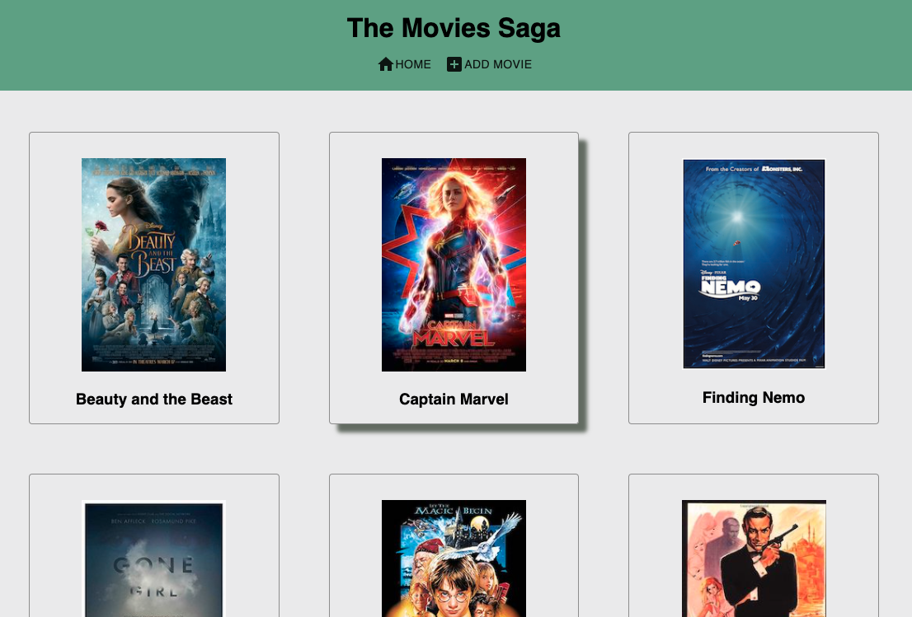
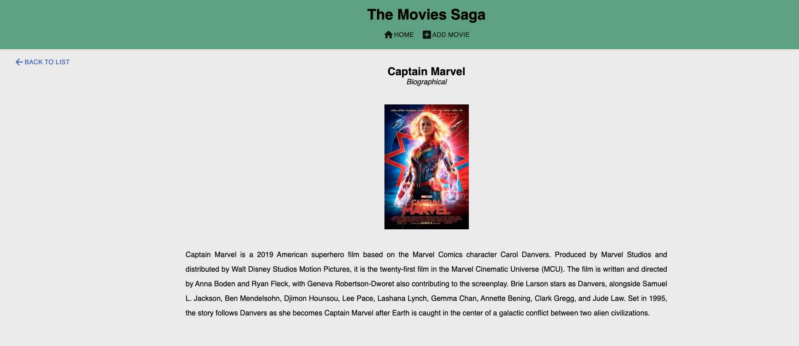

# Project Name

Redux - Movie Gallery

## Description

_Duration: Weekend Challenge_

The sixth weekend challenge of Prime Digital Academy. The challenge was to use React.js/Redux to display a list of movies, click on a movie to view more information about it, and include a form for users to create a new movie item in the list. 

## Screenshot

*Movie List with hover effect*

*The Movie Details view*

*Form page to enter in a new movie*

### Prerequisites

- [Node.js](https://nodejs.org/en/)
- [React.js](https://reactjs.org/)
- [Redux](https://redux.js.org/)
- [postgresql](https://www.postgresql.org/)
- [Postico](https://eggerapps.at/postico/)

## Installation

1. Download code from Github
2. Open the folder in an editor of your choice
3. Run an 'npm install' in your terminal
4. Run 'npm install pg' to install postgresql
5. Create a Database called "saga_movies_weekend" (using Postico)
6. Using the database.sql code, create a table in the database
7. Run 'npm run server' in your terminal to start the server
8. Run 'npm run client' in another terminal to start the React Server
9. React will open your default browser to localhost:3000!

## Usage

1. View a list of all of the movies on the homepage (/)
2. Click on any movie and go to the details page (details/x) to see the movie's genres and description. 
3. Click on the "Add Movie" button to add a new movie to the list (/addmovie)
4. Fill out the form and click submit
5. You will now see the new movie included in the list on the homepage

## Built With

HTML // CSS // Javascript // React.js // Redux // Material-UI // node.js 

## License

[MIT](https://choosealicense.com/licenses/mit/)

## Acknowledgements

Thanks to [Prime Digital Academy](www.primeacademy.io), and specifically Myron Schippers, Edan Schwartz, and Chad Smith who equipped me with the knowledge that helped me to make this application a reality.
